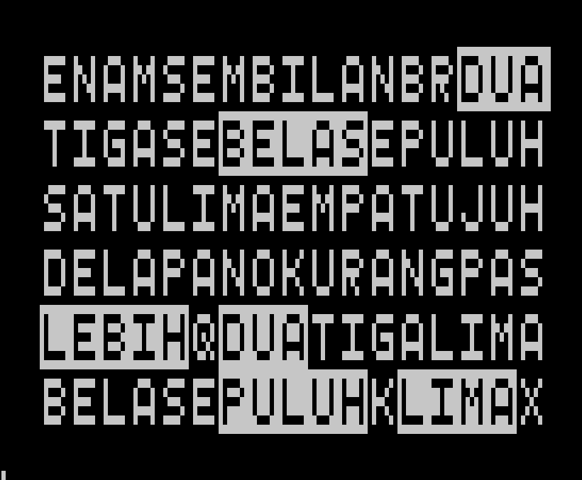

# wordclockid -- Word Clock Bahasa Indonesia

## Fitur
letter: 6 baris x 17 kolom

Display Jam:
- SATU
- DUA
- TIGA
- EMPAT
- LIMA
- ENAM
- TUJUH
- DELAPAN
- SEMBILAN
- SEPULUH
- SEBELAS
- DUA BELAS

Display Menit:
- PAS
- LEBIH DUA
- LEBIH TIGA
- LEBIH LIMA
- LEBIH SEPULUH
- LEBIH DUA BELAS
- LEBIH TIGA BELAS
- LEBIH LIMA BELAS
- LEBIH DUA PULUH
- LEBIH DUA PULUH LIMA
- LEBIH TIGA PULUH
- KURANG TIGA PULUH
- KURANG DUA PULUH LIMA
- KURANG DUA PULUH
- KURANG LIMA BELAS
- KURANG TIGA BELAS
- KURANG DUA BELAS
- KURANG SEPULUH
- KURANG LIMA
- KURANG TIGA
- KURANG DUA
